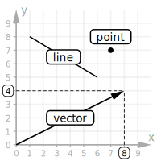
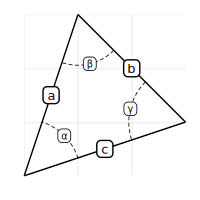
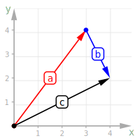
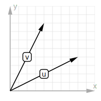
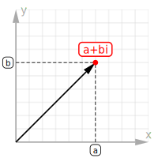
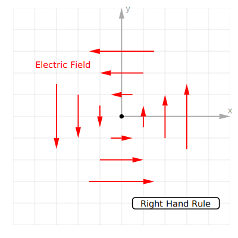

# Vector Graph

Generate high-quality geometry and vector graphs with HTML:

<table>
  <tr>
    <td>
      
    </td>
    <td>
      
    </td>
    <td>
      
    </td>
  </tr>
    <tr>
      <td align="center">Basic building blocks</td>
      <td align="center">Geometry and angles</td>
      <td align="center">Crank it up a notch</td>
    </tr>
</table>

```html
<vector-graph width="200" height="200" units id="basics">
  <vector label="vector" to="8,4" axis></vector>
  <line label="line" from="1,8" to="6,5"></line>
  <point label="point" x="7" y="7"></point>
</vector-graph>

<vector-graph width="200" height="200" x="3" y="3" axis="false" id="triangle">
  <line label="a" from="0,0" to="1,3"></line>
  <line label="b" from="3,1" to="1,3"></line>
  <line label="c" from="0,0" to="3,1"></line>
  <angle label="α" x="0" y="0" from="71.6" to="18.4"></angle>
  <angle label="β" x="1" y="3" from="251.6" to="315"></angle>
  <angle label="γ" x="3" y="1" from="135" to="198.4"></angle>
</vector-graph>

<vector-graph width="200" height="200" x="4.9" y="4.9" id="complete">
  <vector label="b" color="blue" from="3,4" to="4,2" axis></vector>
  <vector label="a" color="red" from="0,0" to="3,4" axis></vector>
  <vector label="c" from="0,0" to="4,2"></vector>
</vector-graph>
```

## Getting started

To use this library as usual you'll need three things. First, import it from a CDN; put this line anywhere in your HTML:

```
<script src="https://cdn.jsdelivr.net/npm/vector-graph"></script>
```

Now let's draw a graph anywhere within your HTML:



```html
<vector-graph width="200" height="200" grid id="plain">
  <vector label="u" to="8,4"></vector>
  <vector label="v" to="4,8"></vector>
</vector-graph>
```

Finally, please take a minute to understand the license of vector-graph. We are [dual-licensed](#license), GNU AGPL free license and a commercial license available:

<button>\$9 BUY A LICENSE</button> <button>AGPL LICENSE</button>

## Documentation

### \<vector-graph>

| attribute | default      | description                                                |
| --------- | ------------ | ---------------------------------------------------------- |
| `width`   | `"600"`      | The width of the containing SVG element (pixels)           |
| `height`  | `"400"`      | The height of the containing SVG element (pixels)          |
| `x`       | `"0,10"`     | The x-coordinates of the graph to fit into the SVG         |
| `y`       | `"0,10"`     | The y-coordinates of the graph to fit into the SVG         |
| `labels`  | `['x', 'y']` | [BUG] Text to display alongside both axis (x,y)            |
| `units`   | `"false"`    | Show the numbers on each of the axis                       |
| `grid`    | `"1"`        | The size of the grid, or `false` to hide it                |
| `dark`    | _mediaquery_ | Dark theme (true), light theme (false) or auto (undefined) |
| `pad`     | `"24"`       | The space around the content to avoid SVG clipping         |

### \<point>

| attribute | default   | description                                       |
| --------- | --------- | ------------------------------------------------- |
| `x`       | 🚫        | The horizontal coordinate where to draw the point |
| `y`       | 🚫        | The vertical coordinate where to draw the point   |
| `label`   | 🚫        | The text to draw on top of the point              |
| `color`   | `"black"` | The color of the point, it can be a name or hexa  |
| `axis`    | `"false"` | Draw the horizontal and vertical coordinate lines |

### \<line>

| attribute | default   | description                                      |
| --------- | --------- | ------------------------------------------------ |
| `to`      | 🚫        | The point where the line/segment ends            |
| `from`    | `"0,0"`   | The point where the line/segment starts          |
| `label`   | 🚫        | Text to draw on the middle of the line           |
| `color`   | `"black"` | The color of the line, it can be a name or hexa  |
| `width`   | `"1.75"`  | The stroke width of the line to draw             |
| `dashed`  | `"false"` | Show as dashes (true) or as a solid line (false) |

### \<circle>

### \<vector>

| attribute | default   | description                                       |
| --------- | --------- | ------------------------------------------------- |
| `to`      | 🚫        | The point where the vector ends with an arrow     |
| `from`    | `"0,0"`   | The point where the vector starts                 |
| `label`   | 🚫        | Text to draw on the middle of the line            |
| `color`   | `"black"` | The color of the line, it can be a name or hexa   |
| `axis`    | `"false"` | Draw the horizontal and vertical coordinate lines |

### \<angle>

### \<text>

| attribute | default    | description                                          |
| --------- | ---------- | ---------------------------------------------------- |
| `text`    | 🚫         | The content that goes inside the label               |
| `x`       | 🚫         | The horizontal coordinate where to draw the label    |
| `y`       | 🚫         | The vertical coordinate where to draw the label      |
| `color`   | `"black"`  | Color of text and border, it can be a name or hexa   |
| `size`    | `"normal"` | Define how big it is: "tiny, small, normal or large" |
| `width`   | auto       | The width of the label, leave it empty               |

### \<label>

| attribute | default    | description                                          |
| --------- | ---------- | ---------------------------------------------------- |
| `text`    | 🚫         | The content that goes inside the label               |
| `x`       | 🚫         | The horizontal coordinate where to draw the label    |
| `y`       | 🚫         | The vertical coordinate where to draw the label      |
| `color`   | `"black"`  | Color of text and border, it can be a name or hexa   |
| `size`    | `"normal"` | Define how big it is: "tiny, small, normal or large" |
| `width`   | auto       | The width of the label, leave it empty               |
| `height`  | auto       | The height of the label, leave it empty              |

## Examples



```html
<vector-graph width="200" height="200" id="imaginary">
  <vector to="6,6"></vector>
  <point label="a+bi" x="6" y="6" color="red"></point>
</vector-graph>
```

### Full XY Plane



```html
<vector-graph width="400" height="400" x="-5,5" y="-5,5" id="electromagnetism">
  <point x="0" y="0"></point>

  <text text="Electric Field" x="-2.7" y="2.4" color="red"></text>
  <label text="Right Hand Rule" x="2.5" y="-4"></label>

  <vector color="red" from="-0.5,-1" to="0.5,-1"></vector>
  <vector color="red" from="0.5,1" to="-0.5,1"></vector>
  <vector color="red" from="1,-0.5" to="1,0.5"></vector>
  <vector color="red" from="-1,0.5" to="-1,-0.5"></vector>

  <vector color="red" from="-1,-2" to="1,-2"></vector>
  <vector color="red" from="1,2" to="-1,2"></vector>
  <vector color="red" from="2,-1" to="2,1"></vector>
  <vector color="red" from="-2,1" to="-2,-1"></vector>

  <vector color="red" from="-1.5,-3" to="1.5,-3"></vector>
  <vector color="red" from="1.5,3" to="-1.5,3"></vector>
  <vector color="red" from="3,-1.5" to="3,1.5"></vector>
  <vector color="red" from="-3,1.5" to="-3,-1.5"></vector>
</vector-graph>
```

## Environments

### Javascript

```
npm i vector-graph
```

### React

### Vue

### Node.js

You can run this on the Node.js side to generate static SVGs as well. To do so, you'll need to install `jsdom` on your own and then use it like this:

```js
import { JSDOM } from "jsdom";
import graph from "vector-graph";

// Make some of these variable accessible from anywhere
const dom = new JSDOM();
global.window = dom.window;
global.document = window.document;
global.DOMParser = window.DOMParser;

// Render the HTML to SVG
const svg = graph(`
  <vector-graph width="200" height="200">
    <point label="point" x="7" y="7"></point>
    <line label="line" from="0,0" to="4,8"></line>
    <vector label="vector" to="8,4"></vector>
  </vector-graph>
`);

console.log(svg);
// <svg width="200" height="200" viewBox="...">...</svg>
```

## License

This library is dual-licensed:

- GNU AGPL is the default license
- Commercial license available for either:
  - Sponsors of my [Open Source](https://github.com/sponsors/franciscop/), valid for as long as you are a sponsor
  - Buy a lifetime license for \$19 [in here](https://www.paypal.me/franciscopresencia/19).
