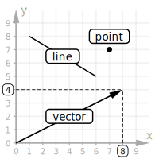
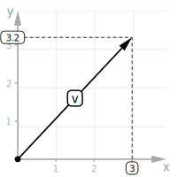

# Plane Graph

Render simple euclidian plane graphics in SVG:

```html
<plane-graph width="200" height="200" grid>
  <vector label="u" to="8,4"></vector>
  <vector label="v" to="4,8"></vector>
</plane-graph>

<plane-graph width="200" height="200" x="390" y="390" grid="100">
  <vector label="v" to="300,320" axis />
</plane-graph>

<plane-graph width="400" height="400" x="4.9" y="4.9">
  <vector label="b" color="blue" from="3,4" to="4,2" axis></vector>
  <vector label="a" color="red" from="0,0" to="3,4" axis></vector>
  <vector label="c" from="0,0" to="4,2"></vector>
  <label text="c = a + b" x="1" y="3" width="100" large></label>
</plane-graph>
```

<table>
  <tr>
    <td>
      
    </td>
    <td>
      
    </td>
    <td>
      
    </td>
  </tr>
</table>
