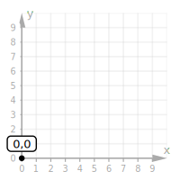
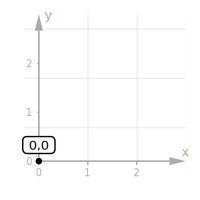
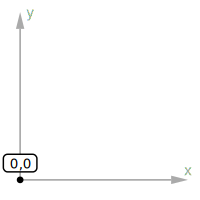
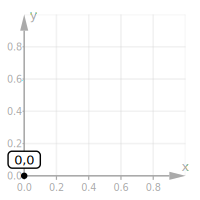
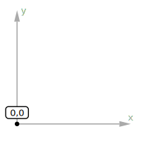
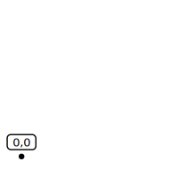
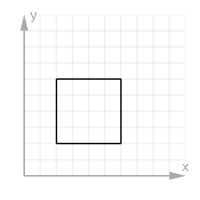
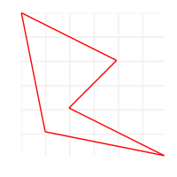
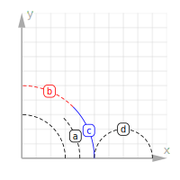
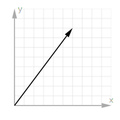

# Vector Graph

> ⚠️ This library is experimental [until 1.0.0 in npm](https://www.npmjs.com/vector-graph). For updates [follow me](https://twitter.com/fpresencia)!

Generate high-quality geometry and vector graphs with HTML:

<table>
  <tr>
    <td>
      
    </td>
    <td>
      
    </td>
    <td>
      
    </td>
  </tr>
    <tr>
      <td align="center">Basic building blocks</td>
      <td align="center">Geometry and angles</td>
      <td align="center">Crank it up a notch</td>
    </tr>
</table>

```html
<vector-graph id="basics" units>
  <line label="line" from="1,8" to="6,5"></line>
  <point label="point" x="7" y="7"></point>
  <vector label="vector" to="8,4" axis></vector>
</vector-graph>

<vector-graph id="triangle" x="3" y="3" axis="false">
  <polygon points="0,0;1,3;3,1" sides="a,b,c" angles="α,β,γ"></polygon>
</vector-graph>

<vector-graph id="complete" x="4.9" y="4.9">
  <vector label="b" color="blue" from="3,4" to="4,2" axis></vector>
  <vector label="a" color="red" from="0,0" to="3,4" axis></vector>
  <vector label="c" from="0,0" to="4,2"></vector>
</vector-graph>
```

> Note: none of the `id`s are necessary, but we add them because it's nice

## Getting started

To use this library as usual you'll need three things. First, import it from a CDN; put this line anywhere in your HTML:

```
<script src="https://cdn.jsdelivr.net/npm/vector-graph"></script>
```

Now let's draw a graph anywhere within your HTML:


```html
<vector-graph grid id="plain">
  <vector label="u" to="8,4"></vector>
  <vector label="v" to="4,8"></vector>
</vector-graph>
```

Finally, please take a minute to understand the license of vector-graph. We are [dual-licensed](#license), GNU AGPL free license and a commercial license available:

<button>\$9 BUY A LICENSE</button> <button>AGPL LICENSE</button>

## Documentation

### \<vector-graph>

| attribute | default      | description                                            |
| --------- | ------------ | ------------------------------------------------------ |
| `width`   | `200`        | The width of the containing SVG element (pixels)       |
| `height`  | `200`        | The height of the containing SVG element (pixels)      |
| `x`       | `0,10`       | The x-coordinates of the graph to fit into the SVG     |
| `y`       | `0,10`       | The y-coordinates of the graph to fit into the SVG     |
| `units`   | `false`      | Show the numbers on each of the axis                   |
| `grid`    | `1`          | The size of the grid, or `false` to hide it            |
| `axis`    | `x,y`        | The X and Y axis labels, or `false` to hide the axis   |
| `dark`    | _mediaquery_ | Dark theme (true), light theme (false) or auto (undef) |
| `pad`     | `24`         | The space around the content to avoid SVG clipping     |

Control the grid size and position with `x`, `y` and `grid`:

<table>
  <tr>
    <td>
      
    </td>
    <td>
      
    </td>
    <td>
      
    </td>
  </tr>
    <tr>
      <td align="center">Default grid 10x10</td>
      <td align="center">Shifted and scaled</td>
      <td align="center">No grid at all</td>
    </tr>
</table>

```html
<vector-graph id="default-grid" units>
  <point label="0,0" x="0" y="0"></point>
</vector-graph>

<vector-graph id="shifted-grid" x="-0.3,3" y="-0.3,3" units>
  <point label="0,0" x="0" y="0"></point>
</vector-graph>

<vector-graph id="center-grid" x="-2.8,2.8" y="-2.8,2.8" units>
  <point label="0,0" x="0" y="0"></point>
</vector-graph>
```

You can also hide the different parts of the grid; let's change the size, remove the `units` and disable the `axis` and `grid`:

<table>
  <tr>
    <td>
      
    </td>
    <td>
      
    </td>
    <td>
      
    </td>
  </tr>
    <tr>
      <td align="center">1x1 grid of 0.2 steps</td>
      <td align="center">Hide the grid</td>
      <td align="center">Hide grid and axis</td>
    </tr>
</table>

```html
<vector-graph id="small-grid" x="0,1" y="0,1" grid="0.2" units>
  <point label="0,0" x="0" y="0"></point>
</vector-graph>

<vector-graph id="no-grid" grid="false">
  <point label="0,0" x="0" y="0"></point>
</vector-graph>

<vector-graph id="no-axis" grid="false" axis="false">
  <point label="0,0" x="0" y="0"></point>
</vector-graph>
```

### \<point>

Draws a small circle in the graph that represents a point in space:


```html
<vector-graph id="point">
  <point label="a"></point>
  <point x="2" y="1"></point>
  <point x="4" y="2" label="c" color="blue"></point>
  <point x="6" y="5" label="d" axis></point>
  <point x="8" y="8" label="e" color="red" axis></point>
</vector-graph>
```

| attribute | default | description                                       |
| --------- | ------- | ------------------------------------------------- |
| `x`       | `0`     | The horizontal coordinate where to draw the point |
| `y`       | `0`     | The vertical coordinate where to draw the point   |
| `label`   | _none_  | The text to draw on top of the point              |
| `color`   | `black` | The color of the point, it can be a name or hexa  |
| `axis`    | `false` | Draw the horizontal and vertical coordinate lines |

### \<line>

| attribute | default | description                                      |
| --------- | ------- | ------------------------------------------------ |
| `to`      | _none_  | The point where the line/segment ends            |
| `from`    | `0,0`   | The point where the line/segment starts          |
| `label`   | _none_  | Text to draw on the middle of the line           |
| `color`   | `black` | The color of the line, it can be a name or hexa  |
| `width`   | `1.75`  | The stroke width of the line to draw             |
| `dashed`  | `false` | Show as dashes (true) or as a solid line (false) |

### \<circle>

| attribute | default | description                                      |
| --------- | ------- | ------------------------------------------------ |
| `x`       | `0`     | The horizontal coordinate of the circle's center |
| `y`       | `0`     | The vertical coordinate of the circle's center   |
| `radius`  | `1`     | The circle's radius, in coordinates size         |
| `label`   | _none_  | Text to draw on the middle of the line           |
| `color`   | `black` | The color of the line, it can be a name or hexa  |
| `width`   | `1.75`  | The stroke width of the line to draw             |

### \<vector>

| attribute | default | description                                       |
| --------- | ------- | ------------------------------------------------- |
| `to`      | _none_  | The point where the vector ends with an arrow     |
| `from`    | `0,0`   | The point where the vector starts                 |
| `label`   | _none_  | Text to draw on the middle of the line            |
| `color`   | `black` | The color of the line, it can be a name or hexa   |
| `axis`    | `false` | Draw the horizontal and vertical coordinate lines |

### \<polygon>

| attribute | default | description                                     |
| --------- | ------- | ----------------------------------------------- |
| `points`  | _none_  | All of the points of the domain                 |
| `color`   | `black` | The color of the line, it can be a name or hexa |
| `angles`  | `false` | Draw the angles in the internal vertices        |

<table>
  <tr>
    <td>
      
    </td>
    <td>
      
    </td>
    <td>
      
    </td>
  </tr>
    <tr>
      <td align="center">Simple polygon</td>
      <td align="center">Different shapes</td>
      <td align="center">With angles</td>
    </tr>
</table>

```html
<vector-graph id="regular-polygon">
  <polygon points="2,2;6,2;6,6;2,6"></polygon>
</vector-graph>

<vector-graph id="complex-polygons" axis="false" x="6" y="6">
  <polygon points="1,1;6,0;2,2;4,4;0,6" color="red"></polygon>
</vector-graph>

<vector-graph id="angles-polygon" axis="false">
  <polygon points="1,1;7,1;9,9;1,7" angles="a,b,c,d"></polygon>
</vector-graph>
```

### \<angle>

Draws an arc representing the angle between two existing lines (the lines must be drawn separately).



```html
<vector-graph id="angle">
  <angle to="90" radius="3"></angle>
  <angle label="a" to="45" radius="4"></angle>
  <angle label="b" from="45" to="90" radius="5" color="red"></angle>
  <angle label="c" to="45" radius="5" color="blue" dashed="false"></angle>
  <angle label="d" x="7" radius="2" from="0" to="180"></angle>
</vector-graph>
```

| attribute | default  | description                                      |
| --------- | -------- | ------------------------------------------------ |
| `x`       | `0`      | The horizontal coordinate of the angle's center  |
| `y`       | `0`      | The vertical coordinate of the angle's center    |
| `from`    | `0`      | The angle (in degrees) to start drawing the arc  |
| `to`      | _none_   | The angle (in degrees) to finish drawing the arc |
| `radius`  | `1`      | The angle's arc radius, in coordinates size      |
| `label`   | _none_   | Text to draw on the middle of the line           |
| `color`   | `black`  | The color of the line, it can be a name or hexa  |
| `size`    | `normal` | The label's size                                 |
| `dashed`  | `true`   | Draw dashes instead of a solid line              |

### \<text>

| attribute | default  | description                                          |
| --------- | -------- | ---------------------------------------------------- |
| `text`    | _none_   | The content that goes inside the label               |
| `x`       | _none_   | The horizontal coordinate where to draw the label    |
| `y`       | _none_   | The vertical coordinate where to draw the label      |
| `color`   | `black`  | Color of text and border, it can be a name or hexa   |
| `size`    | `normal` | Define how big it is: "tiny, small, normal or large" |
| `width`   | _auto_   | The width of the label, leave it empty               |

### \<label>

| attribute | default  | description                                          |
| --------- | -------- | ---------------------------------------------------- |
| `text`    | _none_   | The content that goes inside the label               |
| `x`       | _none_   | The horizontal coordinate where to draw the label    |
| `y`       | _none_   | The vertical coordinate where to draw the label      |
| `color`   | `black`  | Color of text and border, it can be a name or hexa   |
| `size`    | `normal` | Define how big it is: "tiny, small, normal or large" |
| `width`   | _auto_   | The width of the label, tip: leave it empty          |
| `height`  | _auto_   | The height of the label, tip: leave it empty         |

## Examples


```html
<vector-graph id="imaginary">
  <vector to="6,6" axis="a,b"></vector>
  <point label="a+bi" x="6" y="6" color="red"></point>
</vector-graph>
```

### Full XY Plane


```html
<vector-graph width="400" height="400" x="-5,5" y="-5,5" id="electromagnetism">
  <point x="0" y="0"></point>

  <text text="Electric Field" x="-2.7" y="2.4" color="red"></text>
  <label text="Right Hand Rule" x="2.5" y="-4"></label>

  <vector color="red" from="-0.5,-1" to="0.5,-1"></vector>
  <vector color="red" from="0.5,1" to="-0.5,1"></vector>
  <vector color="red" from="1,-0.5" to="1,0.5"></vector>
  <vector color="red" from="-1,0.5" to="-1,-0.5"></vector>

  <vector color="red" from="-1,-2" to="1,-2"></vector>
  <vector color="red" from="1,2" to="-1,2"></vector>
  <vector color="red" from="2,-1" to="2,1"></vector>
  <vector color="red" from="-2,1" to="-2,-1"></vector>

  <vector color="red" from="-1.5,-3" to="1.5,-3"></vector>
  <vector color="red" from="1.5,3" to="-1.5,3"></vector>
  <vector color="red" from="3,-1.5" to="3,1.5"></vector>
  <vector color="red" from="-3,1.5" to="-3,-1.5"></vector>
</vector-graph>
```

## Environments

### Javascript

Follow the [Getting Started](#getting-started) guide and it'll all work great. You can include the script at the beginning or at the end of your HTML, it doesn't matter.

### React

### Vue

### Wordpress

### Node.js

You can run this on the Node.js side to generate static SVGs as well. To do so, you'll need to install `jsdom` on your own and then use it like this:

```js
import { JSDOM } from "jsdom";
import graph from "vector-graph";

// Make some of these variable accessible from anywhere
const dom = new JSDOM();
global.window = dom.window;
global.document = window.document;
global.DOMParser = window.DOMParser;

// Render the HTML to SVG
const svg = graph(`
  <vector-graph>
    <point label="point" x="7" y="7"></point>
    <line label="line" from="0,0" to="4,8"></line>
    <vector label="vector" to="8,4"></vector>
  </vector-graph>
`);

console.log(svg);
// <svg width="200" height="200" viewBox="...">...</svg>
```

## About Vector Graph

I love Katex and I've written several tutorials in the past about mathematics, but I've felt that we are lacking on a way of describing mathematic vectors and equations easily on the web.

There is one project that does a similar thing, but it's way too large (680kb of JS!) and overly complex in my opinion. Instead, I just wanted a way of easily define a simple graph with plain HTML, something like this:



```html
<vector-graph id="about">
  <vector to="6,8"></vector>
</vector-graph>
```

So after some experimenting and seeing it was possible, I decided to create this library. I'm using SVG since it is scalable and its API is not terrible to work with. It's also not awesome to work with, hence a non-trivial part of the library internals are dedicated to work around some SVG issues.

Now, I've spent _a lot_ of hours creating this and I'm releasing it for everyone to use for free. My ask is that if you want to use my work, you either also release your work for others to use, or compensate me so I can keep building amazing things!

## License

This library is dual-licensed:

- **GNU Affero GPL** is the default license. This might be too strict and relaxed to _GPL_ or _LGPL_ on the release date, we'll see. I pick this for now since it's better to start strict and then relax the license than the other way around.
- **Commercial license** available for either:
  - (NOTE: not yet available) **Sponsors** of my [Open Source](https://github.com/sponsors/franciscop/) can use any of my software in proprietary projects. This is valid for as long as you are a sponsor.
  - **Buy a lifetime license** of this project for \$19 [in here](https://www.paypal.me/franciscopresencia/19).
